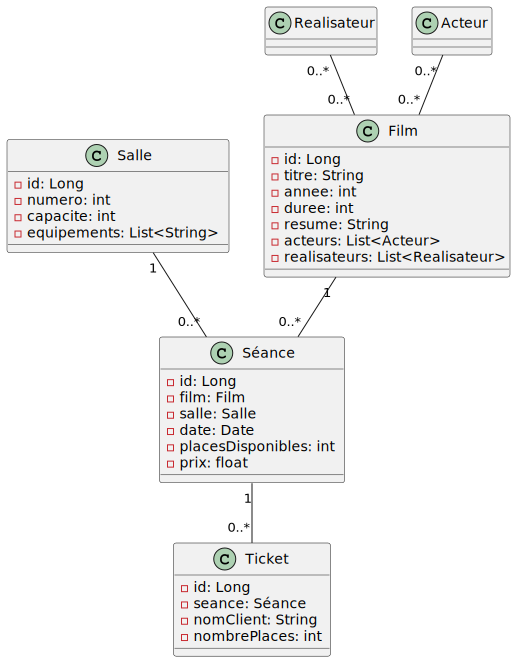

# Projet Cinema

## Présentation

Le but de ce projet est de créer une API REST en spring boot pour la gestion d'un cinéma.

## Sujets

__Objectif__ : Créer une API qui permet de gérer les films, les séances, les salles, les tickets, les acteurs et les réalisateurs d'un cinéma.

#### Fonctionnalités de base:

- Ajouter, modifier, supprimer et afficher les `films`
- Ajouter, modifier, supprimer et afficher les `séances`
- Ajouter, modifier, supprimer et afficher les `salles`
- Ajouter, modifier, supprimer et afficher les `tickets`
- Ajouter, modifier, supprimer et afficher les `acteurs`
- Ajouter, modifier, supprimer et afficher les `réalisateurs`

#### Fonctionnalités avancées:

- ~~Associer des `acteurs` et des `réalisateurs` à des `films` (fait pendant le cours)~~
- Réserver des `tickets` pour une séance donnée
  * Modification de la méthode `save` dans `TicketService`. La méthode renverra
    une erreur 409 (conflict) si aucune place n'est disponible sinon décrémentera
    le nombre de places disponibles dans la séance et ajoutera la réservation.
  * Appelle de la méthode dans `TicketController` sur la route `/tickets` en `POST`.
  * mapping dans le controller pour utiliser le DTO `TicketDto`
- Afficher la liste des `films` disponibles à une date donnée
  * Création d'une query JPQL dans `FilmJpaRepository` qui affiche les films à la date donnée grâce à une jointure `LEFT JOIN FETCH`, `FETCH`permettant de charger les données immédiatement.
  * Création de la méthode `findByDate` dans `FilmService`
  * Appel de la méthode dans `FilmController`. Route `films/byDate?date={date}`
  * mapping dans le controller pour utiliser le DTO `FilmCompletDto`
- Afficher la liste des `salles` disponibles à une date et à une heure données
  * Création de la méthode `findSallesAvailableByDate` dans `SalleService` qui récupère toutes les séances à une date donnée, récupère également toutes les salles puis filtre en supprimant les salles contenues dans séances et retourne les salles
  * Appel de la méthode dans `SalleService` route : `salles/byDate?date={date}`
  * mapping dans le controller pour utiliser le DTO `SalleDto`
- Afficher la liste des `tickets` réservés pour une séance donnée
    * Creation de `findBySeance` dans `TicketRepository`
    * Logique dans `TicketService` avec la méthode `findBySeance`
    * route : `tickets/seances/{id}`
    * mapping avec `TicketReduitDto` dans controller (affiche que les tickets et non les séances)

Pour réaliser cet exercice, vous devrez utiliser Spring Boot Web pour créer une API REST qui expose les différentes fonctionnalités de gestion de données. Vous devrez également utiliser un SGBD (comme MySQL ou H2) pour stocker les données de l'application et utiliser JPA (Java Persistence API) pour effectuer les opérations de persistance. Vous devrez enfin utiliser Maven ou Gradle pour gérer les dépendances et le cycle de vie du projet.

## Prérequis

- Java 11
- Docker et Docker Compose

## Installation

Dans un terminal, exécuter la commande suivante:

```bash
docker-compose up -d
```

### Lancer le code pour le développement

Dans un IDE comme IntelliJ IDEA, ouvrir le projet et lancer la classe `CinemaApplication`.

### Lancer le code pour la production

Dans un terminal, exécuter la commande suivante:

```bash
# Pour Linux
mvn clean package

# Pour Windows
mvnw.cmd clean package
```

Vous trouverez le fichier `cinema-0.0.1-SNAPSHOT.jar` dans le dossier `target`.

Pour lancer le fichier `.jar`, exécuter la commande suivante:

```bash
java -jar target/cinema-0.0.1-SNAPSHOT.jar
```

## Utilisation

TODO

## Diagramme de classes

